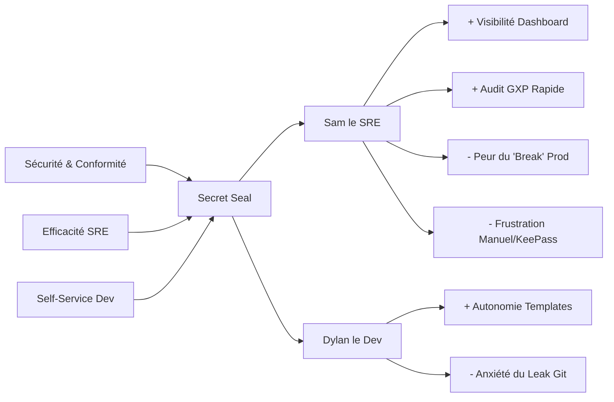

# Trigger Map: Secret Seal

## 1. Business Goals (3x3)

### Goal 1: Assurer la Sécurité & Conformité Sanofi (Primary)
*Ultimate business success through risk mitigation.*
- **Objective 1.1:** 100% des secrets de la plateforme MES migrés hors de KeePass d'ici la fin du PoC.
- **Objective 1.2:** Zéro "leak" de secrets en clair détecté par les scans de sécurité ou audits GXP.
- **Objective 1.3:** Obtention d'une validation formelle de l'architecture par la Cybersécurité globale Sanofi.

### Goal 2: Optimiser l'Efficacité Opérationnelle SRE (Prerequisite)
*Working smarter to reduce human error and overhead.*
- **Objective 2.1:** Réduire de 80% le temps moyen de création ou de rotation d'un secret complexe.
- **Objective 2.2:** 100% des secrets critiques monitorés avec des alertes proactives à 9 mois d'ancienneté.
- **Objective 2.3:** Zéro incident de production lié à une expiration de secret non anticipée.

### Goal 3: Démocratiser la Gestion des Secrets (Self-Service) (Prerequisite)
*Empowering developers to ensure tool adoption.*
- **Objective 3.1:** 100% des développeurs capables de générer un secret conforme via template sans intervention SRE.
- **Objective 3.2:** Extension de l'outil à au moins 2 nouvelles plateformes Sanofi d'ici 6 mois.
- **Objective 3.3:** Score de satisfaction utilisateur (NPS interne) > 4.5/5.

---

## 2. Product/Solution
**Secret Seal** : Orchestrateur de secrets GitOps agnostique pour OpenShift, automatisant le flux "Vault -> SealedSecret -> Git" avec un dashboard de santé par Namespace.

---

## 3. Target Groups (Summary)
1. **Sam le SRE (SRE Sam) — Priorité 1** : Gestionnaire de l'infrastructure, garant de la stabilité et de la sécurité.
2. **Dylan le Développeur (Dev Dylan) — Priorité 2** : Utilisateur des secrets pour ses applications, cherche l'autonomie.
3. **Division Cybersécurité — Priorité 3** : Validateur de la solution, cherche la preuve de conformité.

---

## 4. Driving Forces (Psychology)

### Sam le SRE (Priority 1)
- ✅ **Visibilité Totale** : "Visualiser instantanément la santé des secrets du cluster (Dashboard) pour éviter les pannes imprévues lors du check matinal."
- ✅ **Confiance dans le Sync** : "Confirmer que le secret scellé dans Git correspond exactement à la version du Vault avant de déclencher Argo CD."
- ❌ **Peur de la Panne** : "Éviter de casser la production lors d'une rotation de secret à cause d'une erreur de syntaxe manuelle dans le YAML."
- ❌ **Frustration de la Répétition** : "Réduire la charge mentale de devoir re-configurer les mêmes types de secrets pour chaque nouveau namespace."

### Dylan le Développeur (Priority 2)
- ✅ **Autonomie & Vitesse** : "Créer un secret de base de données valide en 30 secondes via un template pour ne pas bloquer le déploiement de son app."
- ❌ **Anxiété du Leak** : "Éviter de 'leaker' accidentellement un secret dans Git en manipulant des fichiers en clair sur son poste local."

---

## Trigger Map Diagram (Mermaid)

